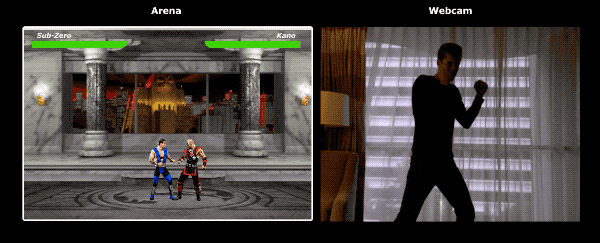
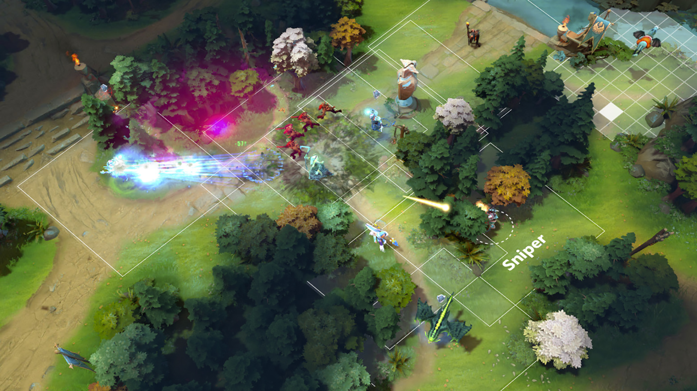
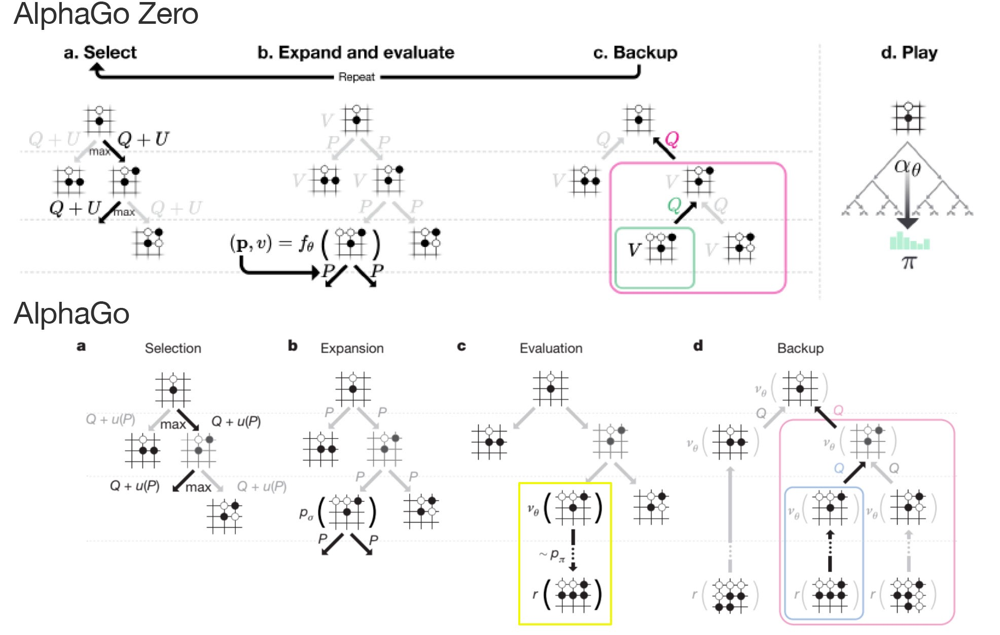
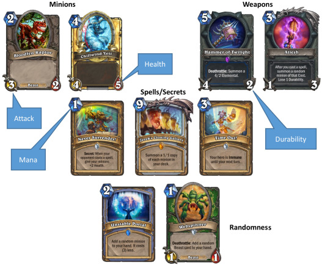
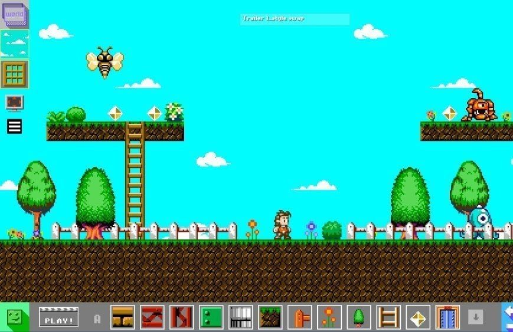
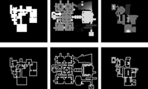
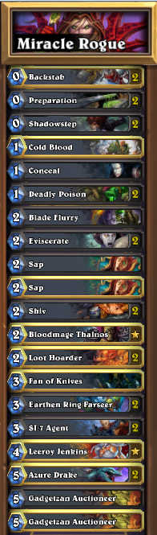
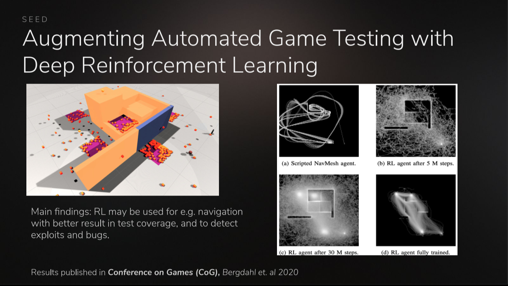

## GAIblog, update constantly :)  
> **讨论了游戏AI顶会论文归纳与分类，算法及其应用探讨**  
  
中文版，GAMEAI学习paper清单推荐和记录,不断更新，欢迎交流,请查看wiki页面~  
Some Recommanded and Marked paper for GAMEAI learning, The details are listed in wiki page  
:point_down::point_down::point_down::point_down::point_down::point_down::point_down::point_down::point_down::point_down::point_down::point_down::point_down::point_down:
<h1><a href="https://github.com/ls361664056/GameAI-paper-list/wiki">请诸位老爷移步Wiki 页面(Wiki Page) 欢迎补充</a></h1>  
:point_up_2::point_up_2::point_up_2::point_up_2::point_up_2::point_up_2::point_up_2::point_up_2::point_up_2::point_up_2::point_up_2::point_up_2::point_up_2::point_up_2:  
 
因为国内并没有发现公众号或是学校专门讲通用游戏算法这一块，笔者结合了自己的爱好建立了这个repo  

# 游戏领域的AI应用  
AI作为时下计算机算法的超级巨星，在例如CV、NLP、语音、机器人等诸多领域都有广泛的应用。 而在游戏领域，AI的应用往往被认为是类人玩家型AI，算法的第一印象也通常是强化学习。但实际当中，AI在游戏中的应用缺不止于此。本文就来介绍一下游戏领域的AI应用与算法。  
  
首先摆在我们面前的是，**为什么要研究游戏AI呢？**  
> 游戏可以看做是对于现实问题的折射，研究游戏AI对我们解决现实中的问题可以提供有价值的样本。
> 此外，因为游戏领域的多样性，多种形式的AI方法可以分别或结合在不同的游戏中。
> 最后，和大部分其他领域的AI问题相比，游戏AI很有趣不是吗 :P  
  
在游戏领域中，AI的应用其实并不仅仅是人们印象中的玩家型战斗AI。传统意义上的游戏制作融入了AI的方法之后在各个环节都催生了相应的应用与算法。如果我们将一款游戏拆开来看他的各个环节，这些AI的应用就变得直观起来。  
* **游戏画面生成**
在游戏制作的环节里，开发者需要制作相应角色的动画模型，来满足使用者在游戏内视觉上的需求，在传统的游戏制作上，通常需要一名专门游戏原画师来制作相应的内容，但是聚焦到游戏内角色们的表情与动作这些细节上时，动画的设计通常变得吃力不讨好起来，应用视觉AI可以将人们的动作投影到角色身上，生成相应的动作表情；而在环境的设计中，AI也可以起到相似的效果，通过输入现实的图片来得到相应的游戏画面。在这个问题上，CV中的机器学习方法例如**姿态识别，表情识别，GAN**等起到了关键性的作用  

  

 

<i>动作识别</i>
 
    

  

 

<i>表情识别</i>
  
    

* **玩家型AI**
该类型应该是最被大众所熟知的游戏AI类型，2017年AlphaGo击败世界围棋冠军李世石，2019年OpenAI Five击败DOTA2世界冠军OG证明了AI在游戏上的表现可以超越人类。而此类AI问题本质上可以看成是路径规划问题，即根据当前的游戏状态生成相应的动作序列。典型的以**强化学习、深度强化学习**为代表的游戏AI目前在国内的游戏工业界已被大量研究，在某些游戏类型例如棋牌类、回合制策略游戏中，**蒙特卡洛搜索树（行为树）、演化算法、A***等在线学习算法也具有一定优势。  

  

 

<i>深度强化学习</i>
  
    
  

  

 

<i>基于蒙特卡洛搜索树的深度强化学习</i>
  
    

  

 

<i>演化算法</i>
  
    

  

 

<i>A*</i>
  
    

  
* **游戏内容生成**  
  在这一方面的AI应用常常不为人所知，通常被称为Procedural Content Generation(PCG)。在游戏内容（地图）的产出上，以魔兽争霸3为例，一方面依赖于游戏本体制作时开发者制作的地图；另一方面依赖于社区玩家的自定义地图，而社区玩家内容又更是由玩家数量所决定，丰富且可行的游戏内容是吸引玩家入坑的重要保障。利用AI去生成可行的游戏内容是非常值得研究的方向。目前该方向的主流算法包括**演化算法、GAN等**。  

<i>AI generator</i>
  
    
  

  

 

<i>GAN</i>
  
    
  
* **游戏初始化平衡AI**
  目前在卡牌类游戏中，为了初始化得到的卡牌或是环境相对平衡，在PVE游戏中体现为玩家可以战胜Bot，PVP游戏例如炉石传说、自走棋，防止出现双方卡牌差距过大导致输掉，可以利用AI来设计发牌的策略。该方向的主要算法为**演化算法**。  
  

  

 

<i>炉石中的演化算法平衡牌组</i>
  
    
  
* **游戏测试**
  在游戏制作完成后，开发者们需要测试游戏内存在的bug，这毫无疑问是重要的，如果一款游戏存在大量的bug，对该游戏的评价和收益都会造成巨大的影响。而测试游戏需要大量的时间，在这一方面，测试专用的agent可以被设计来面对这一挑战，目前这一块的算法主要为**蒙特卡洛搜索树、强化学习、深度强化学习**等。

  

 

<i>深度强化学习自动测试agent</i>
  
    
  
* **用户画像**
  在游戏的运营过程中，玩家在游戏内的行为会产生丰富且复杂的数据，这些数据内折射了玩家的行为，分析并合理利用这些数据可以提炼出有价值的信息，这些信息可以用作促进游戏更新更多玩家喜欢的内容，预测玩家的行为和喜好，检测作弊外挂等。这一种游戏中的数据分析问题被称为用户画像问题，利用合理的**机器学习**算法可以极大提升玩家的游戏体验。  

  

 

<i>用户画像分析</i>
  
    
  
游戏领域的AI还有更多的应用例如**路径规划、前向模型、博弈论**等。 
  
而游戏上的算法探索也能折射到现实的问题中，例如类人Agent的成功使得机器人领域也同步进行强化学习等路径规划类算法的迁移与落地；除了提高了玩家的游戏体验，节约了开发者的工作时间，游戏画面生成、游戏内容生成等generator的成功促进了GAN的发展与落地；游戏也提供了一个前所未有的互动平台，由此采集的玩家数据具有多种维度的属性，丰富且复杂，用户数据的分析不仅仅对游戏的开发者来说作用非凡，对行为研究者、数据科学家而言这些数据也是意义重大；博弈论的AI更是折射了现实中的决策问题，研究这些AI的方法促进了决策者们做出更有利的决策。  
  
真心的期待更多的伙伴一起加入这个有意思的AI研究领域，探索更多的AI玩法。
